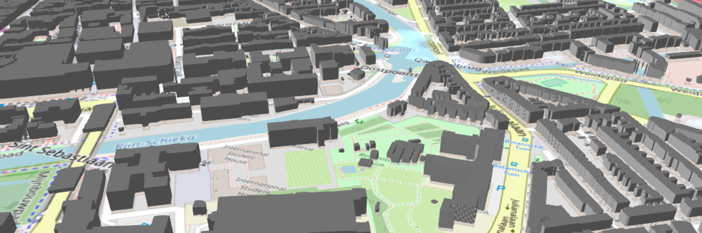

citygml-to-3dtiles
==================

[](https://travis-ci.org/njam/citygml-to-3dtiles)
[](https://www.npmjs.com/package/citygml-to-3dtiles)

A very *basic and experimental* converter from [CityGML](https://www.citygml.org/) to [Cesium 3D Tiles](https://github.com/AnalyticalGraphicsInc/3d-tiles).

About
-----

The purpose of this JavaScript code is to read CityGML files, extract objects (like buildings),
and write the corresponding meshes as a [batched 3D model](https://github.com/AnalyticalGraphicsInc/3d-tiles/blob/master/TileFormats/Batched3DModel/README.md) in the *3D Tiles* spec.
Each building will become a *feature*, and its attributes will be stored in the *3D Tiles batch table*. 

The code for writing *3D Tiles* files is based on the [3D Tiles Samples Generator](https://github.com/AnalyticalGraphicsInc/3d-tiles-tools/tree/master/samples-generator).

The functionality is *very* basic, and many **limitations** exist:
- Only city objects of type `Building` are converted.
- Textures are not converted.
- Only a single *B3DM* file is generated. (This works fine for small data sets, for larger sets probably a hierarchy of multiple files with different resolutions should be generated.)
- Files larger than 2GB cannot be converted because of the limits of NodeJS' `Buffer`.

Usage
-----

### CLI Script

To convert a CityGML XML file to a 3D Tileset:
```
./bin/citygml-to-3dtiles.mjs <input.xml> <output/>
```

When converting larger files the memory limit of Node might need to be increased:
```
node \
  --max-old-space-size=10000 \  # 10GB memory
  --experimental-modules \      # The code uses ESM JS-modules, so this needs to be enabled
  ./bin/citygml-to-3dtiles.mjs <input.xml> <output/>
```

### Programmatic Usage

The converter can be used programmatically, which allows for customizing the conversion.
```js
import Converter from "citygml-to-3dtiles";

let converter = new Converter();
await converter.convertFiles('./input.xml', './output/');
```

#### Option: `propertiesGetter`
By default any CityGML *attributes* and *external references* are stored in the 3D Tiles *batch table*.
Additional properties can be stored per feature by passing `propertiesGetter`.
This function will be called for each *city object* and should return an object of key/value pairs.

Get the value of an element `<measuredHeight>` in the XML namespace "bldg2" (http://www.opengis.net/citygml/building/2.0)
and store it as "measuredHeight" in the batch table:
```js
let converter = new Converter({
  propertiesGetter: (cityObject, properties) => {
    let measuredHeightNode = cityObject.cityNode.selectNode('./bldg2:measuredHeight');
    let measuredHeight = parseFloat(measuredHeightNode.textContent);
    return {
      measuredHeight: measuredHeight
    }
  }
});

await converter.convertFiles('./input.xml', './output/');
```

Store the convex surface area of each building (calculated from the geometry) in the property "surfaceArea":
```js
import Converter from "citygml-to-3dtiles";

let converter = new Converter({
  propertiesGetter: (cityObject, properties) => {
    let mesh = cityObject.getTriangleMesh();
    return {
      surfaceArea: mesh.getSurfaceArea()
    }
  }
});
await converter.convertFiles('./input.xml', './output/');
```

#### Option: `srsProjections`
The coordinates in CityGML are defined in a certain *spatial reference system* (SRS).
This script assumes that all coordinates in a document are using the *same* SRS.
Height component of coordinates is *not* transformed according to the SRS, because the library used ([proj4js](https://github.com/proj4js/proj4js)) doesn't support it.

Only a few SRS are defined by default. Additional SRS can be passed to the converter:
```
import Converter from "citygml-to-3dtiles";

let converter = new Converter({
  srsProjections: {
    'CH1903': '+proj=somerc +lat_0=46.95240555555556 +lon_0=7.439583333333333 +k_0=1 +x_0=600000 +y_0=200000 +ellps=bessel +towgs84=674.374,15.056,405.346,0,0,0,0 +units=m +no_defs',
  }
});
await converter.convertFiles('./input.xml', './output/');
```

The definition should be in the "PROJ.4" format. Definitions in that format can be found at http://epsg.io/.

Examples
--------

For *Delft* an area is available in CityGML2 LOD1 from [TU Delft](https://3d.bk.tudelft.nl/opendata/3dfier/).


For *Zürich* a small area of LOD2 CityGML is available from [Stadt Zürich, Geomatik Vermessung](https://www.stadt-zuerich.ch/ted/de/index/geoz/geodaten_u_plaene/3d_stadtmodell/demodaten.html).
Here the buildings' hull volume is color coded in Cesium:


Development
-----------
Install dependencies:
```
npm install
```

Run tests:
```
npm test
```

Release a new version:
1. Bump version in `package.json`
2. Push a new tag to master
3. The Travis build will deploy to NPM
